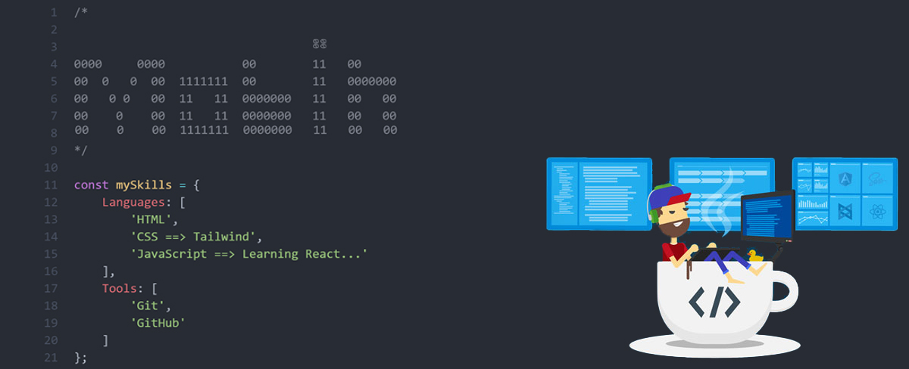

# Hi there , I'm Mobin Izadi 👋 


welcome to my GitHub page! I'm a junior front-end developer who never gets tired of learning. Programming is not just my job; it's the key to a world where I love to be.


## 🔗Table of Contents 
- [About Me](#about-me)
- [Skills](#skills)
- [Projects](#projects)
- [Contact Me](#contact-me)
- [GitHub Stats](#github-stats)


## 👨‍💻About Me

```js
const aboutMe = {
    firstName: 'Mobin',
    lastName:'Izadi',
    age: 26,
    city: 'gorgan',
    jobTitle: 'Junior Front-End Developer',
    education: {
        degree: 'Bachelor of Computer Engineering',
        institution: 'Islamic Azad University, Gorgan',
        graduationYear: 2024
    },
    }
```

## 💻Skills

 
- `Completed ✅ `<br/>


<br/>
<br/>

- `Learning...  📖`<br/>


## ⚡Projects

Coming Soon ...❤️


## 📫Contact Me

-  [mobinizadi.dev@gmail.com](mailto:mobinizadi.dev@gmail.com)
-  [@mobinizadi_dev](https://t.me/mobinizadi_dev)


## 🌱GitHub Stats


`📅 The latest README update: 2024-08-08 `


